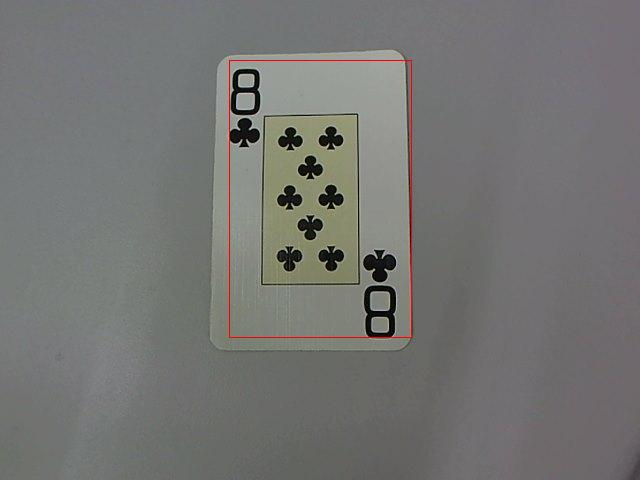

# 1. Introduction

The goal of this program was to be able to detect the location of a playing card in an image and determine its rank and suit through computer vision and some machine learning techniques. With the given training set and test set data our approach performed extremely well, correctly identifying the rank and suit of all the cards in the test set after being trained on the training set.  Our program begins by using adaptive thresholding to determine the location of the card in the image. Once the card is located, it then uses a custom filtering technique to create a binary image of the card’s number and suit symbols. After filtering out the noise, the suit symbols are separated from the card numbers using invariant moments and counted to determine the card’s rank.  To aid in the classification the colour of the card is determined by a technique involving calculating properties of a normalized sub-image. Two Bayesian classifiers are created from the moments of the symbols in the training set (one for black and one for red cards).  These classifiers are then used on the test data to determine the appropriate suit for a given image. While the approach we used works well it definitely has room for improvement, particularly in the speed category.
	
# 2. Methods

The starting point for our program is in the function recognize_card. This function loads a given image and calls the function cardlocation on that image, returning a filtered binary image and a struct with the various regions of the foreground. In addition, cardlocation also displays a bounding box around the card on the original image to the screen with this information. Now that the initially complex image is broken into a more simplified form, findSymbols is called to extract a property matrix for the image that contains the invariant moments for all of the symbols in the image. The created property matrix is then passed into classify_card which determines the card suit and rank from the previously trained Bayesian classifiers.

For creating the binary image, cardlocation uses adaptive thresholding. To accomplish this a modified version adapt.m file from the course web page that is now in the form of a function that takes in the file path of an image and outputs its binary image. After some testing and inspection of our training data we found N=30 and C=20 to be optimal values.  We decided to use adaptive thresholding after having bad results from both static and dynamic thresholding. Thresholding with a static value would not work as it is sensitive to changes in illumination and the training data was full of cards with various illumination. Using an illumination histogram to create a dynamic threshold (findthresh) worked better, yet still had some issues picking up the background, as in some images one corner of the background was much darker than the other.  Adaptive thresholding worked far better the other techniques as it is robust to ignore various illumination and inconsistencies in the background. However the downside to adaptive thresholding is that is is very slow, taking several seconds to complete, and is the primary bottleneck in the program.

Once the binary image is formed, cardlocation uses the library functions bwlabel and regionprops to generate the list of regions in the binary image and their properties. It then creates a bounding box for the card region in the image by drawing a box around all of the found regions. This technique is specific to the situational training/testing data that we were given and would not work if there were multiple cards in an image.

The formed binary image is not perfect as the shadow of the card and the inner rectangle of the card are detected. Before findSymbols can properly create a property matrix for the image it must filter out the irrelevant regions. This is done by examining the height to width ratio and area of each region. FindSymbols discards any regions that have a height to width ratio that is greater than 2 or less than 0.5. This ratio was used because the symbols/numbers of a card tend to have bounding boxes that are relatively square-like while shadows and other noise have a much longer rectangular shape. It also discards any region with an area smaller than 100 as any region smaller than 10x10 pixels was small groupings of darker pixels that were usually caused by the shadow of the card.

From the remaining regions, findSymbols then creates a property matrix for the symbols and numbers in the image by using the provided getproperties method on the sub-image of each of the regions. Each row of the properties matrix consists of the three invariant moments calculated for each region in the image. From these sub-images a final binary image is generated and displayed as well.

Finally, classify_card is called on the generated property matrix to determine the rank and suit of the initially provided card. The first step in this function is removing the rows corresponding to the number regions in the property matrix. Initially we were going to determine the rank of the card by training a model for the numbers of the card but this approach had a couple of problems. Primarily, we did not have enough training data to get an accurate enough classifier. Also the numbers '6' an '9' had identical invariant moments which posed a problem.  We decided to abandon this approach and instead determine rank by counting the remaining regions and subtracting two (to account for the additional symbols under the number). One problem with this approach is that it relies on the assumption that we completely filtered out all irrelevant regions from the property matrix. While this was a safe assumption on the test data it might not be appropriate in real world applications.

Determining the suit is a two step process. First the colour of the card must be determined and then the corresponding Bayes classifier must be ran for that colour. The function findRedBlack  determines if a card if black or red by first normalizing the colour of the original colour image and then taking the ratio of red to other colours in the sub-region of one of the symbols. If the ratio of red to other colours in that sub-region exceeds above a threshold of .45 then the card is red, otherwise it is black. This threshold was determined by experimenting on the values found in various red and black cards in the training data.

Now that the colour is known by classify_card the provided classify function determines which of the remaining two possible suits the card could be. Classify is ran on each of the symbols with a multivariate Gaussian model for that particular colour. The suit of the card is assigned based of what the majority of the symbols were classified as. Now that the suit and rank of the card is determined the program is finished.

N.B. We trained our models in the trainblack and trainred functions. To use these functions, first we saved all of the property matrices for each image in the training set to file (with calls to cardlocation and findSymbols) and then loaded them with readsymprops, a custom helper function. We did this because the overhead of running adaptive thresholding on all 32 images took considerable time and it was faster to simply write to a file once to save time for the rest of the project.

# 3. Results

Detecting the location of the card for the testing set was completely successful.
Below is an example of a bounding box drawn round the detected card.

Locating the numbers and symbols was also an all-round success.
Below is an example of the detected numbers and symbols.

Recognising the symbols was not perfectly successful. We had an overall classification rate of (93.75%). The classification accuracy for both spades and clubs was 100%; however hearts had an accuracy of(86.7%) and for diamonds (88.3%).

Classifying the symbols on [the 4 of Spades](data2/test21.jpg) was successful. All 6 of the symbols were classified as spades. However, for the [3 of Diamonds](data2/test28.jpg), 3 of the symbols were classified as diamonds and 2 as hearts, which is almost causes the card suit to be misclassified.

Card recognition was also entirely successful. The entire testing set was classified 100% correctly.
For an example of this success, [3 of Clubs](data2/test27.jpg) was classified as `“3 of CLUBS”`.

# 4. Discussion

Our program located the card, located the symbols and classified the cards in the testing set 100% correctly. The only issues arose with classifying the individual symbols.

For classifying individual symbols, we had an accuracy of 93.75%. The only confusion that arose was differentiating between hearts and diamonds. 11.7% of hearts were classified as diamonds and 13.3% of diamonds were classified as hearts.

The program has issues with regard to speed. The adaptive thresholding takes about 10 seconds to complete which is rather slow. If we were to improve the program, we would investigate into more efficient ways of segmenting the image.

We did not test our program with self collected test data, so extreme lighting conditions and camera positions may cause the program to perform poorly. Since we discard any regions with an area less than 100 pixels, if the card in the image is too small or far away, the symbols may be ignored causing the card to be misclassified.
